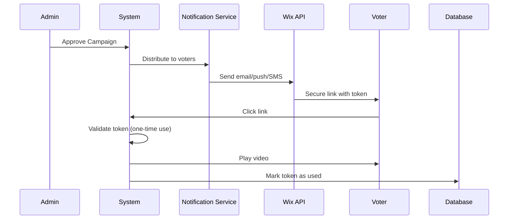

# U9itus – Political Loyalty Ads (Wix App Extension)

**Version:** 2.0.0  
**Framework:** Laravel 12 + Wix App Extension  
**Platform:** Wix Marketplace Plugin  
**Database:** MySQL (Railway Production)  
**Deployment:** Railway.app with Metal Build  
**Production URL:** https://u9itus-production.up.railway.app

## Overview

U9itus is a **secure Wix app extension** that connects **politicians and local governance officials** directly with **potential voters** through paid video messages and live feeds. Politicians pay $0.60 per view; voters earn $0.25 for watching the full message. The platform includes **secure token-based ad delivery**, referral commissions, advanced fraud prevention, and automated batch payouts.

### 🔒 Security-First Architecture

Unlike traditional ad platforms where users can click repeatedly, U9itus uses **push notification-based delivery** with one-time use tokens to prevent fraud and abuse.

> _"Regardless of how much artificial intelligence is used, without the human element the production that AI affords is all for naught. Human beings will still be required to purchase this production. I am offering a solution."_ — Head Enterprises

## Key Features

### Core Business Model — Per-View Economics

| Component                                 | Amount                          |
| ----------------------------------------- | ------------------------------- |
| Politician pays per view                  | **$0.60**                       |
| Voter earns per view                      | **$0.25**                       |
| Referral commission (10% of voter payout) | $0.025                          |
| Payment processing (estimated)            | ~$0.02                          |
| Ops & infrastructure                      | ~$0.03–$0.12                    |
| **Platform net profit**                   | **$0.18–$0.30 (30–50% margin)** |

### User Roles

1. **Politician** — Creates video messages or live feeds, pays to distribute them to voters
2. **Voter** — Watches political messages, earns money, refers friends
3. **Admin** — Approves campaigns, manages fraud, processes payouts

### Wix Integration

- **Wix Dashboard Pages** — Politician, Voter, and Admin dashboards rendered inside Wix
- **Site Widget** — Embeddable video player for voter-facing pages
- **OAuth Flow** — Seamless Wix app installation and token management
- **Webhooks** — Handles app installed/removed and member events
- **Wix Design System** — UI follows Wix visual guidelines

### Political Features

- Governance levels: Federal, State, County, City, School Board, Special District
- Political offices: Mayor, City Council, Governor, US Senator, etc.
- Target by state, city, congressional district
- Video messages + live feeds
- 100% watch requirement (must watch the full message to earn)

### Advanced Security & Fraud Prevention

**Token-Based Ad Delivery:**

- 🔑 Secure one-time use tokens (SHA-256)
- 📧 Email/SMS/Push notification delivery via Wix APIs
- ⏰ 24-hour token expiration
- 🚫 No panel-based ad access (prevents clicking abuse)
- 📊 Complete audit trail of all notifications

**Fraud Detection:**

- Device fingerprinting
- Rate limiting (max 10 ads per 24 hours)
- IP anomaly detection
- Rapid-fire view detection
- Payout hold periods (48-hour verification window)
- Voter trust scoring
- Token replay attack prevention

### Technical Stack

- **Backend**: Laravel 11 (PHP 8.1+)
- **Frontend**: Wix App Extension + Blade templates
- **Wix SDK**: @wix/sdk, @wix/dashboard, @wix/design-system, @wix/members
- **Database**: SQLite (MVP) / PostgreSQL (Production)
- **Authentication**: Wix OAuth + Laravel auth
- **Permissions**: Spatie Laravel Permission
- **Payments**: Stripe (politician billing) + PayPal/CashApp (voter payouts)
- **Testing**: Pest

## Quick Start

### Requirements

- PHP 8.1 or higher
- Composer
- SQLite3
- Node.js 18+ & NPM
- Wix Developer Account (for app publishing)

### Installation

1. **Clone the repository**

```bash
git clone https://github.com/jhead12/u9itus.dev.git
cd u9itus.dev
```

2. **Install dependencies**

```bash
composer install
npm install
```

3. **Environment setup**

```bash
cp .env.example .env
php artisan key:generate
```

Edit `.env` and set your Wix app credentials:

```env
WIX_APP_ID=your-wix-app-id
WIX_APP_SECRET=your-wix-app-secret
WIX_WEBHOOK_SECRET=your-webhook-secret
WIX_APP_URL=https://yourdomain.com
WIX_REDIRECT_URL=/wix/oauth/callback
```

4. **Database setup**

```bash
touch database/database.sqlite
php artisan migrate
```

5. **Build frontend assets**

```bash
npm run build
```

6. **Start development server**

```bash
php artisan serve
```

7. **Start Wix development mode** (in a separate terminal)

```bash
npm run wix:dev
```

## Wix App Setup

1. Create a new app at [Wix Developers](https://dev.wix.com/)
2. Set the **OAuth Redirect URL** to `https://yourdomain.com/wix/oauth/callback`
3. Configure webhooks pointing to `https://yourdomain.com/api/wix/webhooks`
4. Add dashboard pages and widget components as defined in `wix.config.json`
5. Set the required scopes:
    - `SCOPE.DC-MEMBERS.MANAGE-MEMBERS` — Access voter contact info
    - `SCOPE.DC-PAIDPLANS.MANAGE-PLANS` — Manage subscriptions
    - `SCOPE.WIX.EVENTS.READ-WRITE` — Triggered emails
    - `SCOPE.WIX.NOTIFICATIONS` — Push notifications
    - `SCOPE.WIX.AUTOMATIONS` — Marketing automations
    - `SCOPE.WIX.MARKETING.SEND-MESSAGES` — SMS notifications

## 🔐 Secure Notification System

### Why Token-Based Delivery?

**Traditional (Vulnerable):**

- Voters access ad panel and click repeatedly
- Bots can automate viewing
- Hard to prevent fraud

**Token-Based (Secure):**

- System controls when voters receive ads
- One-time use tokens prevent replay attacks
- Rate limiting built-in (10 ads/24 hours)
- Complete audit trail

### How It Works



### Notification Methods

| Method | API                  | Delivery Time | Best For       |
| ------ | -------------------- | ------------- | -------------- |
| Email  | Wix Triggered Emails | 1-5 min       | Primary method |
| Push   | Wix Notifications    | Instant       | Mobile users   |
| SMS    | Wix Marketing        | Instant       | High priority  |

## Application Structure

### Database Schema (Political Tables)

| Table                   | Purpose                                                       |
| ----------------------- | ------------------------------------------------------------- |
| **wix_sites**           | Wix site installations, OAuth tokens, settings                |
| **politicians**         | Politician profiles, governance level, office, district       |
| **voters**              | Voter profiles, wallet balance, referral codes, trust score   |
| **political_campaigns** | Video/live-feed campaigns with per-view pricing and targeting |
| **view_sessions**       | Individual view tracking — watch time, fraud score, payouts   |
| **referral_earnings**   | Referral commission records per view session                  |
| **ad_view_tokens** 🆕   | One-time secure tokens for ad delivery via notifications      |

### Services

| Service                       | Purpose                                                         |
| ----------------------------- | --------------------------------------------------------------- |
| **WixOAuthService**           | OAuth consent URL, token exchange, refresh, API calls           |
| **WixWebhookService**         | Routes Wix webhook events (install, remove, member events)      |
| **WixNotificationService** 🆕 | Secure ad delivery via Wix email/push/SMS with token generation |
| **PoliticalViewService**      | View lifecycle: assign → start → track → complete               |
| **PoliticalPaymentService**   | Campaign billing, batch payouts, per-view profit calculation    |
| **FraudPreventionService**    | Device fingerprinting, rate limits, IP anomalies, trust scoring |

### Controllers

| Controller                    | Purpose                                           |
| ----------------------------- | ------------------------------------------------- |
| **Wix\OAuthController**       | `install()`, `callback()`, `signup()`             |
| **Wix\WebhookController**     | Wix event handling with signature verification    |
| **Wix\DashboardController**   | Dashboard stats, admin panel                      |
| **SecureAdViewController** 🆕 | Token-based ad viewing, notification distribution |
| **Api\PoliticianController**  | Politician CRUD, campaign management              |
| **Api\VoterController**       | Registration, view sessions, earnings             |
| **Api\AdminController**       | Analytics, approvals, payouts, fraud management   |

### Wix Frontend Integration

| Module                          | Purpose                                                     |
| ------------------------------- | ----------------------------------------------------------- |
| **backend/api.jsw** 🆕          | HTTP request utilities for Laravel API communication        |
| **backend/campaigns.jsw** 🆕    | Campaign and voter dashboard data retrieval                 |
| **backend/members.jsw** 🆕      | Wix Member authentication and voter account synchronization |
| **pages/voter-dashboard.js** 🆕 | Complete voter dashboard with real backend data integration |

**Quick Start Guides:**

- [Voter Dashboard Quick Start](docs/wix/VOTER_DASHBOARD_QUICKSTART.md) — Step-by-step setup
- [Backend Integration Guide](docs/wix/BACKEND_INTEGRATION.md) — Architecture and data flow
- [Dashboard Data Mapping](docs/wix/DASHBOARD_DATA_MAPPING.md) — UI element to API mapping

## API Endpoints

### Wix Routes (`/wix/*`)

- `GET /wix/install` — Start OAuth installation flow
- `GET /wix/oauth/callback` — OAuth callback
- `GET /wix/dashboard` — Main dashboard page
- `GET /wix/dashboard/politician` — Politician management page
- `GET /wix/dashboard/voter` — Voter dashboard page
- `GET /wix/dashboard/admin` — Admin dashboard page
- `GET /wix/widget/feed` — Embeddable voter feed widget
- `GET /wix/widget/settings` — Widget settings

### Secure Ad Viewing Routes 🆕

- `GET /ad/view/{token}` — View ad via secure one-time token (from email/SMS)
- `GET /api/v1/tokens/{token}/validate` — Validate token before loading video
- `POST /api/v1/campaigns/{campaign}/distribute` — Distribute ad to eligible voters (Admin)
- `GET /voter/notifications` — View notification history (Voter dashboard)
- `POST /test/notification` — Send test notification (Development)

### Voter API (`/api/v1/*`)

- `POST /api/v1/voters/register` — Register a voter (with optional referral code)
- `GET /api/v1/voters/{voter}/earnings` — Earnings summary
- `GET /api/v1/voters/{voter}/referrals` — Referral earnings
- `POST /api/v1/sessions/{session}/progress` — Heartbeat progress update (from token view)
- `POST /api/v1/sessions/{session}/complete` — Mark view as completed

### Politician API (`/api/v1/*`)

- `POST /api/v1/politicians` — Create politician profile
- `PUT /api/v1/politicians/{politician}` — Update profile
- `POST /api/v1/politicians/{politician}/campaigns` — Create campaign (min $6 budget, min 10 views)
- `GET /api/v1/politicians/{politician}/campaigns` — List campaigns with analytics

### Admin API (`/api/v1/admin/*`)

- `GET /api/v1/admin/analytics` — Platform-wide analytics
- `POST /api/v1/admin/campaigns/{campaign}/approve` — Approve a campaign
- `POST /api/v1/admin/campaigns/{campaign}/reject` — Reject a campaign
- `POST /api/v1/admin/payouts/process` — Run batch payout processing
- `GET /api/v1/admin/flagged-voters` — List fraud-flagged voters
- `POST /api/v1/admin/voters/{voter}/clear-flag` — Clear fraud flag

## Configuration

Key configuration values in `config/u9itus.php`:

```php
'revenue_per_view'         => 0.60,   // Politician pays per view
'voter_payout_per_view'    => 0.25,   // Voter earns per view
'referral_commission_pct'  => 10,     // 10% of voter payout = $0.025
'min_watch_percent'        => 100,    // Must watch full message
'video_duration_min'       => 30,     // Minimum 30 seconds
'video_duration_max'       => 300,    // Maximum 5 minutes
'batch_payout_min'         => 10.00,  // Minimum payout threshold
'fraud_daily_view_limit'   => 50,     // Max views per voter per day
'fraud_payout_hold_hours'  => 48,     // Verification hold period
```

Wix credentials in `config/wix.php`:

```php
'app_id'         => env('WIX_APP_ID'),
'app_secret'     => env('WIX_APP_SECRET'),
'webhook_secret' => env('WIX_WEBHOOK_SECRET'),
```

## Security

- Wix instance verification via JWT on all dashboard/widget routes
- Wix webhook signature verification (HMAC-SHA256)
- Role-based access control via Spatie Permission
- Fraud prevention with multi-signal scoring
- 48-hour payout hold for verification window
- Device fingerprinting to prevent multi-account abuse
- CSRF protection on all forms
- SQL injection prevention via Eloquent ORM

## Known Limitations (MVP)

- SQLite database (upgrade to PostgreSQL for production)
- Stripe test mode only (politician billing)
- PayPal/CashApp payouts are placeholder (no API integration yet)
- No real-time live feed streaming (coming soon)
- No blockchain verification
- Basic video hosting (external URLs — no built-in CDN)

## Future Enhancements

- Live feed streaming via WebRTC or Wix Video
- Real-time notifications via WebSockets
- Advanced fraud detection with ML scoring
- Blockchain-verified view records
- Mobile-optimized voter experience
- Multi-language support
- Advanced analytics dashboard with demographic insights
- Automated Stripe Connect for politician billing
- PayPal Mass Pay API for batch voter payouts

## Development

### Running Tests

```bash
php artisan test
```

### Code Style

```bash
./vendor/bin/pint
```

### Wix Commands

```bash
npm run wix:dev           # Start Wix dev server
npm run wix:build         # Build Wix app
npm run wix:create-version # Create new app version
npm run wix:publish       # Publish to Wix Marketplace
```

### Database Management

```bash
php artisan migrate:fresh   # Fresh migration
php artisan migrate:status  # Check migration status
```

## Support

For issues and questions:

- GitHub Issues: https://github.com/jhead12/u9itus.dev/issues
- Documentation: See INSTALLATION.md for detailed setup guide

## License

MIT License — See LICENSE file for details

## Credits

Developed by Head Enterprises
