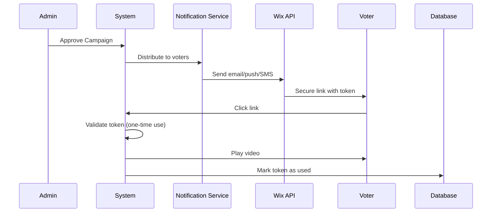

# U9itus – Political Loyalty Ads (Dual-Platform)

**Version:** 2.1.0  
**Framework:** Laravel 12 + Dual-Platform Architecture  
**Platforms:** Wix App Extension + Standalone Application  
**Database:** MySQL (Railway Production)  
**Deployment:** Railway.app with Metal Build  
**Production URL:** https://u9itus-production.up.railway.app  
**Test Suite:** 108 passing, 226 assertions

## Overview

U9itus is a **dual-platform political advertising platform** that connects **politicians and local governance officials** directly with **potential voters** through paid video messages and live feeds. Politicians pay $0.60 per view; voters earn $0.25 for watching the full message. The platform includes **secure token-based ad delivery**, referral commissions, advanced fraud prevention, and automated batch payouts.

### 🚀 Dual-Platform Architecture

U9itus supports **two deployment modes** from a single codebase:

1. **Wix App Extension** — Integrated into Wix marketplace for their 200M+ users
2. **Standalone Application** — Direct deployment for enterprise clients and white-label solutions

This architecture provides maximum market reach while maintaining code efficiency. See [Dual-Platform Architecture Guide](doc/DUAL_PLATFORM_ARCHITECTURE.md) for details.

### 🔒 Security-First Architecture

Unlike traditional ad platforms where users can click repeatedly, U9itus uses **push notification-based delivery** with one-time use tokens to prevent fraud and abuse.

> _"Regardless of how much artificial intelligence is used, without the human element the production that AI affords is all for naught. Human beings will still be required to purchase this production. I am offering a solution."_ — Head Enterprises

## Key Features

### Core Business Model — Per-View Economics

| Component                                 | Amount                          |
| ----------------------------------------- | ------------------------------- |
| Politician pays per view                  | **$0.60**                       |
| Voter earns per view                      | **$0.25**                       |
| Referral commission (10% of voter payout) | $0.025                          |
| Payment processing (estimated)            | ~$0.02                          |
| Ops & infrastructure                      | ~$0.03–$0.12                    |
| **Platform net profit**                   | **$0.18–$0.30 (30–50% margin)** |

### User Roles

1. **Politician** — Creates video messages or live feeds, pays to distribute them to voters
2. **Voter** — Watches political messages, earns money, refers friends
3. **Admin** — Approves campaigns, manages fraud, processes payouts

### Wix Integration

- **Wix Dashboard Pages** — Politician, Voter, and Admin dashboards rendered inside Wix
- **Site Widget** — Embeddable video player for voter-facing pages
- **OAuth Flow** — Seamless Wix app installation and token management
- **Webhooks** — Handles app installed/removed and member events
- **Wix Design System** — UI follows Wix visual guidelines

### Political Features

- Governance levels: Federal, State, County, City, School Board, Special District
- Political offices: Mayor, City Council, Governor, US Senator, etc.
- Target by state, city, congressional district
- Video messages + live feeds
- 100% watch requirement (must watch the full message to earn)

### Advanced Security & Fraud Prevention

**Token-Based Ad Delivery:**

- 🔑 Secure one-time use tokens (SHA-256)
- 📧 Email/SMS/Push notification delivery via Wix APIs
- ⏰ 24-hour token expiration
- 🚫 No panel-based ad access (prevents clicking abuse)
- 📊 Complete audit trail of all notifications

**Fraud Detection:**

- Device fingerprinting
- Rate limiting (max 10 ads per 24 hours)
- IP anomaly detection
- Rapid-fire view detection
- Payout hold periods (48-hour verification window)
- Voter trust scoring
- Token replay attack prevention

### Technical Stack

- **Backend**: Laravel 12 (PHP 8.2+)
- **Frontend**: Wix App Extension + Blade templates (Tailwind CSS dark theme)
- **Wix SDK**: @wix/sdk, @wix/dashboard, @wix/design-system, @wix/members
- **Database**: SQLite (development) / MySQL (Railway production)
- **Authentication**: Wix OAuth + Laravel auth (Standalone)
- **Permissions**: Spatie Laravel Permission (roles: `admin`, `politician`, `voter`)
- **Payments**: Stripe (politician billing) + PayPal/CashApp (voter payouts — placeholder)
- **Testing**: Pest (108 tests, 226 assertions)

## Quick Start

### Requirements

- PHP 8.1 or higher
- Composer
- SQLite3
- Node.js 18+ & NPM
- Wix Developer Account (for app publishing)

### Installation

1. **Clone the repository**

```bash
git clone https://github.com/jhead12/u9itus.dev.git
cd u9itus.dev
```

2. **Install dependencies**

```bash
composer install
npm install
```

3. **Environment setup**

```bash
cp .env.example .env
php artisan key:generate
```

Edit `.env` and configure your platform mode:

```env
# Platform Configuration
# Options: 'wix', 'standalone', or 'dual' (both platforms enabled)
PLATFORM_MODE=dual

# Wix App Configuration (required for Wix mode)
WIX_APP_ID=your-wix-app-id
WIX_APP_SECRET=your-wix-app-secret
WIX_WEBHOOK_SECRET=your-webhook-secret
WIX_APP_URL=https://yourdomain.com
WIX_REDIRECT_URL=/wix/oauth/callback

# Standalone App Configuration (required for standalone mode)
APP_URL=https://yourdomain.com
FRONTEND_URL=https://app.yourdomain.com

# Database Configuration
DB_CONNECTION=sqlite
# DB_CONNECTION=mysql (for production)
```

4. **Database setup**

```bash
touch database/database.sqlite
php artisan migrate
```

5. **Build frontend assets**

```bash
npm run build
```

6. **Start development server**

```bash
php artisan serve
```

## Platform Modes

U9itus can run in three different modes:

### Wix Mode Only

```bash
PLATFORM_MODE=wix php artisan serve
```

- Only Wix routes active (`/wix/*`)
- Wix OAuth required
- Dashboard embedded in Wix iframes

### Standalone Mode Only

```bash
PLATFORM_MODE=standalone php artisan serve
npm run dev  # For frontend assets
```

- Only standalone routes active (`/dashboard`, `/politician/*`, `/voter/*`)
- Standard Laravel authentication
- Full-featured SPA interface

### Dual Mode (Recommended for Development)

```bash
PLATFORM_MODE=dual php artisan serve
npm run dev
```

- Both Wix and standalone routes active
- Test both platforms simultaneously
- Shared backend API and database

See [Dual-Platform Architecture Guide](doc/DUAL_PLATFORM_ARCHITECTURE.md) for detailed information.

## Wix App Setup (Wix Mode Only)

1. Create a new app at [Wix Developers](https://dev.wix.com/)
2. Set the **OAuth Redirect URL** to `https://yourdomain.com/wix/oauth/callback`
3. Configure webhooks pointing to `https://yourdomain.com/api/wix/webhooks`
4. Add dashboard pages and widget components as defined in `wix.config.json`
5. Set the required scopes:
    - `SCOPE.DC-MEMBERS.MANAGE-MEMBERS` — Access voter contact info
    - `SCOPE.DC-PAIDPLANS.MANAGE-PLANS` — Manage subscriptions
    - `SCOPE.WIX.EVENTS.READ-WRITE` — Triggered emails
    - `SCOPE.WIX.NOTIFICATIONS` — Push notifications
    - `SCOPE.WIX.AUTOMATIONS` — Marketing automations
    - `SCOPE.WIX.MARKETING.SEND-MESSAGES` — SMS notifications

## 🔐 Secure Notification System

### Why Token-Based Delivery?

**Traditional (Vulnerable):**

- Voters access ad panel and click repeatedly
- Bots can automate viewing
- Hard to prevent fraud

**Token-Based (Secure):**

- System controls when voters receive ads
- One-time use tokens prevent replay attacks
- Rate limiting built-in (10 ads/24 hours)
- Complete audit trail

### How It Works



### Notification Methods

| Method | API                  | Delivery Time | Best For       |
| ------ | -------------------- | ------------- | -------------- |
| Email  | Wix Triggered Emails | 1-5 min       | Primary method |
| Push   | Wix Notifications    | Instant       | Mobile users   |
| SMS    | Wix Marketing        | Instant       | High priority  |

## Application Structure

### Database Schema (Political Tables)

| Table                          | Purpose                                                        |
| ------------------------------ | -------------------------------------------------------------- |
| **wix_sites**                  | Wix site installations, OAuth tokens, settings                 |
| **politicians**                | Politician profiles, governance level, office, district, party |
| **voters**                     | Voter profiles, wallet balance, referral codes, trust score    |
| **political_campaigns**        | Video/live-feed campaigns with per-view pricing and targeting  |
| **view_sessions**              | Individual view tracking — watch time, fraud score, payouts    |
| **referral_earnings**          | Referral commission records per view session                   |
| **ad_view_tokens**             | One-time secure tokens for ad delivery via notifications       |
| **campaign_transactions**      | Stripe payment records per politician                          |
| **politician_credits**         | Credit balance ledger for per-view billing                     |
| **politician_payment_methods** | Stored Stripe payment methods per politician                   |

### Services

| Service                     | Purpose                                                            |
| --------------------------- | ------------------------------------------------------------------ |
| **WixOAuthService**         | OAuth consent URL, token exchange, refresh, API calls              |
| **WixWebhookService**       | Routes Wix webhook events (install, remove, member events)         |
| **WixNotificationService**  | Secure ad delivery via Wix email/push/SMS with token generation    |
| **PoliticalViewService**    | View lifecycle: assign → start → track → complete                  |
| **PoliticalPaymentService** | Campaign billing, batch payouts, per-view profit calculation       |
| **FraudPreventionService**  | Device fingerprinting, rate limits, IP anomalies, trust scoring    |
| **CampaignBillingService**  | Stripe PaymentIntent creation, credit top-up, credit deduction     |
| **StripePaymentService**    | Low-level Stripe SDK wrapper (customers, payment methods, intents) |

### Controllers

| Controller                          | Platform   | Purpose                                                                            |
| ----------------------------------- | ---------- | ---------------------------------------------------------------------------------- |
| **Wix\OAuthController**             | Wix        | `install()`, `callback()`, `signup()`                                              |
| **Wix\WebhookController**           | Wix        | Wix event handling with signature verification                                     |
| **Wix\DashboardController**         | Wix        | Dashboard stats, admin panel                                                       |
| **Standalone\AuthController**       | Standalone | Separate politician/voter registration, shared login, admin portal, password reset |
| **Standalone\DashboardController**  | Standalone | Role-based dashboard routing                                                       |
| **Standalone\PoliticianController** | Standalone | Full campaign CRUD, video upload, analytics, billing, profile                      |
| **Standalone\VoterController**      | Standalone | Ad watching, earnings, referrals                                                   |
| **Standalone\AdminController**      | Standalone | User management, fraud, payouts, campaign approval                                 |
| **SecureAdViewController**          | Both       | Token-based ad viewing, notification distribution                                  |
| **Api\PoliticianController**        | Both       | Politician CRUD, campaign management (API)                                         |
| **Api\VoterController**             | Both       | Registration, view sessions, earnings (API)                                        |
| **Api\AdminController**             | Both       | Analytics, approvals, payouts, fraud (API)                                         |
| **Api\StripeWebhookController**     | Both       | `payment_intent.succeeded` / `payment_intent.payment_failed`                       |

### Standalone Frontend Views

All standalone views use the dark Tailwind CSS theme (`slate-900` background, `emerald-400/500` accents).

#### Authentication Views (`resources/views/standalone/auth/`)

| View                            | Purpose                                                                      |
| ------------------------------- | ---------------------------------------------------------------------------- |
| `login.blade.php`               | Shared login with Politician / Voter portal tabs                             |
| `admin-login.blade.php`         | Dedicated admin portal (amber-accented, role-enforced)                       |
| `register-choose.blade.php`     | Role chooser landing — Politician 🏛️ vs Voter 🗳️ cards                       |
| `register-politician.blade.php` | Politician signup: credentials + office, party, governance level, state/city |
| `register-voter.blade.php`      | Voter signup: credentials + state, ZIP, referral code                        |
| `forgot-password.blade.php`     | Password reset request                                                       |
| `reset-password.blade.php`      | Set new password (token-based)                                               |

#### Politician Dashboard Views (`resources/views/standalone/politician/`)

| View                           | Purpose                                                                          |
| ------------------------------ | -------------------------------------------------------------------------------- |
| `dashboard.blade.php`          | Overview stats: campaigns, views, spend, pending credits                         |
| `campaigns/index.blade.php`    | Campaign card grid with status badges, pause/resume actions                      |
| `campaigns/create.blade.php`   | New campaign form with live budget↔views sync                                    |
| `campaigns/show.blade.php`     | Campaign detail, Submit for Review button, video upload panel, session log       |
| `campaigns/edit.blade.php`     | Edit campaign — pre-filled, live feed toggle, target states JS                   |
| `analytics.blade.php`          | Platform-wide analytics overview with campaign breakdown table                   |
| `analytics/campaign.blade.php` | Per-campaign session stats (status breakdown, session log)                       |
| `billing.blade.php`            | Credit balance, add-funds form, credit ledger, Stripe transaction history        |
| `invoices.blade.php`           | Full paginated transaction history with status badges                            |
| `profile.blade.php`            | Edit profile (office, party, bio, governance, district) + read-only account info |

### Wix Frontend Integration

| Module                       | Purpose                                                     |
| ---------------------------- | ----------------------------------------------------------- |
| **backend/api.jsw**          | HTTP request utilities for Laravel API communication        |
| **backend/campaigns.jsw**    | Campaign and voter dashboard data retrieval                 |
| **backend/members.jsw**      | Wix Member authentication and voter account synchronization |
| **pages/voter-dashboard.js** | Complete voter dashboard with real backend data integration |

**Quick Start Guides:**

- [Voter Dashboard Quick Start](docs/wix/VOTER_DASHBOARD_QUICKSTART.md) — Step-by-step setup
- [Backend Integration Guide](docs/wix/BACKEND_INTEGRATION.md) — Architecture and data flow
- [Dashboard Data Mapping](docs/wix/DASHBOARD_DATA_MAPPING.md) — UI element to API mapping

## API Endpoints

> **Total routes:** 124 registered routes across Wix, Standalone, and API layers.

### Authentication Routes (Standalone)

| Method | URL                       | Purpose                                     |
| ------ | ------------------------- | ------------------------------------------- |
| `GET`  | `/login`                  | Shared login page (Politician / Voter tabs) |
| `POST` | `/login`                  | Authenticate and redirect by role           |
| `GET`  | `/admin/login`            | Dedicated admin portal                      |
| `POST` | `/admin/login`            | Admin-only authentication (role-enforced)   |
| `GET`  | `/register`               | Role-chooser landing page                   |
| `GET`  | `/register/politician`    | Politician registration form                |
| `POST` | `/register/politician`    | Create politician account + profile         |
| `GET`  | `/register/voter`         | Voter registration form                     |
| `POST` | `/register/voter`         | Create voter account + profile              |
| `GET`  | `/forgot-password`        | Password reset request                      |
| `GET`  | `/reset-password/{token}` | Reset password form                         |
| `POST` | `/logout`                 | Sign out                                    |

### Politician Dashboard Routes (`/politician/*`)

Requires `auth`, `verified`, and `role:politician` middleware.

| Method   | URL                                        | Purpose                                     |
| -------- | ------------------------------------------ | ------------------------------------------- |
| `GET`    | `/politician/dashboard`                    | Overview stats                              |
| `GET`    | `/politician/campaigns`                    | Campaign list                               |
| `GET`    | `/politician/campaigns/create`             | New campaign form                           |
| `POST`   | `/politician/campaigns`                    | Store new campaign                          |
| `GET`    | `/politician/campaigns/{id}`               | Campaign detail                             |
| `GET`    | `/politician/campaigns/{id}/edit`          | Edit campaign form                          |
| `PUT`    | `/politician/campaigns/{id}`               | Update campaign                             |
| `DELETE` | `/politician/campaigns/{id}`               | Delete campaign (draft only)                |
| `POST`   | `/politician/campaigns/{id}/pause`         | Pause active campaign                       |
| `POST`   | `/politician/campaigns/{id}/resume`        | Resume paused campaign                      |
| `POST`   | `/politician/campaigns/{id}/submit-review` | Submit draft for admin review               |
| `POST`   | `/politician/campaigns/{id}/upload-video`  | Upload campaign video                       |
| `GET`    | `/politician/analytics`                    | Platform-wide analytics overview            |
| `GET`    | `/politician/analytics/{id}`               | Per-campaign analytics detail               |
| `GET`    | `/politician/billing`                      | Credit balance + Stripe transaction history |
| `POST`   | `/politician/billing/add-funds`            | Create Stripe PaymentIntent to add credits  |
| `GET`    | `/politician/billing/invoices`             | Full paginated transaction history          |
| `GET`    | `/politician/profile`                      | View/edit profile                           |
| `PUT`    | `/politician/profile`                      | Update political profile                    |

### Voter Dashboard Routes (`/voter/*`)

Requires `auth`, `verified`, and `role:voter` middleware.

| Method | URL                              | Purpose                               |
| ------ | -------------------------------- | ------------------------------------- |
| `GET`  | `/voter/dashboard`               | Earnings overview                     |
| `GET`  | `/voter/watch/{token}`           | Load ad via secure token              |
| `POST` | `/voter/watch/{token}/start`     | Mark session started                  |
| `POST` | `/voter/watch/{token}/complete`  | Mark session complete, trigger payout |
| `GET`  | `/voter/earnings`                | Earnings summary                      |
| `GET`  | `/voter/earnings/history`        | Earnings history                      |
| `POST` | `/voter/earnings/request-payout` | Request cash payout                   |
| `GET`  | `/voter/referrals`               | Referral overview                     |
| `GET`  | `/voter/referrals/link`          | Get personal referral link            |
| `GET`  | `/voter/preferences`             | Notification preferences              |
| `PUT`  | `/voter/preferences`             | Update preferences                    |
| `GET`  | `/voter/profile`                 | Profile page                          |
| `PUT`  | `/voter/profile`                 | Update profile                        |

### Admin Dashboard Routes (`/admin/*`)

Requires `auth`, `verified`, and `role:admin` middleware. Access via `/admin/login`.

| Method | URL                              | Purpose                     |
| ------ | -------------------------------- | --------------------------- |
| `GET`  | `/admin/dashboard`               | Admin overview              |
| `GET`  | `/admin/campaigns/pending`       | Campaigns awaiting approval |
| `POST` | `/admin/campaigns/{id}/approve`  | Approve campaign            |
| `POST` | `/admin/campaigns/{id}/reject`   | Reject campaign             |
| `GET`  | `/admin/users`                   | User list                   |
| `GET`  | `/admin/users/{id}`              | User detail                 |
| `PUT`  | `/admin/users/{id}/suspend`      | Suspend user                |
| `PUT`  | `/admin/users/{id}/unsuspend`    | Reinstate user              |
| `GET`  | `/admin/fraud`                   | Fraud dashboard             |
| `GET`  | `/admin/fraud/flagged-views`     | Flagged view sessions       |
| `POST` | `/admin/fraud/views/{id}/review` | Review a flagged session    |
| `GET`  | `/admin/payouts`                 | Payout overview             |
| `GET`  | `/admin/payouts/pending`         | Pending voter payouts       |
| `POST` | `/admin/payouts/batch-process`   | Run batch payout processing |
| `GET`  | `/admin/analytics`               | Platform analytics          |
| `GET`  | `/admin/reports/revenue`         | Revenue report              |
| `GET`  | `/admin/reports/engagement`      | Engagement report           |
| `GET`  | `/admin/settings`                | System settings             |
| `PUT`  | `/admin/settings`                | Update settings             |

### Wix Routes (`/wix/*`)

| Method | URL                         | Purpose                       |
| ------ | --------------------------- | ----------------------------- |
| `GET`  | `/wix/install`              | Start OAuth installation flow |
| `GET`  | `/wix/oauth/callback`       | OAuth callback                |
| `GET`  | `/wix/dashboard`            | Main dashboard page           |
| `GET`  | `/wix/dashboard/politician` | Politician management page    |
| `GET`  | `/wix/dashboard/voter`      | Voter dashboard page          |
| `GET`  | `/wix/dashboard/admin`      | Admin dashboard page          |
| `GET`  | `/wix/widget`               | Embeddable voter feed widget  |
| `GET`  | `/wix/widget/settings`      | Widget settings               |
| `POST` | `/api/wix/webhooks`         | Wix webhook receiver          |

### REST API (`/api/v1/*`)

#### Politician API

| Method | URL                                         | Purpose                   |
| ------ | ------------------------------------------- | ------------------------- |
| `POST` | `/api/v1/politicians`                       | Create politician profile |
| `GET`  | `/api/v1/politicians/{id}`                  | Get politician            |
| `PUT`  | `/api/v1/politicians/{id}`                  | Update profile            |
| `POST` | `/api/v1/politicians/{id}/campaigns`        | Create campaign           |
| `GET`  | `/api/v1/politicians/{id}/campaigns`        | List campaigns            |
| `GET`  | `/api/v1/politicians/{id}/campaigns/{cid}`  | Campaign detail           |
| `GET`  | `/api/v1/politicians/{id}/billing/balance`  | Credit balance            |
| `POST` | `/api/v1/politicians/{id}/billing/purchase` | Purchase credits          |

#### Voter API

| Method | URL                                         | Purpose                                      |
| ------ | ------------------------------------------- | -------------------------------------------- |
| `POST` | `/api/v1/voters`                            | Register voter (with optional referral code) |
| `GET`  | `/api/v1/voters/{id}`                       | Get voter profile                            |
| `GET`  | `/api/v1/voters/{id}/earnings`              | Earnings summary                             |
| `GET`  | `/api/v1/voters/{id}/referrals`             | Referral earnings                            |
| `GET`  | `/api/v1/voters/{id}/campaigns`             | Available campaigns for voter                |
| `POST` | `/api/v1/voters/{id}/campaigns/{cid}/watch` | Assign watch session token                   |
| `GET`  | `/api/v1/voters/{id}/history`               | View history                                 |
| `POST` | `/api/v1/sessions/{session}/progress`       | Heartbeat / progress update                  |
| `POST` | `/api/v1/sessions/{session}/complete`       | Mark view completed                          |

#### Admin API

| Method | URL                                    | Purpose                     |
| ------ | -------------------------------------- | --------------------------- |
| `GET`  | `/api/v1/admin/analytics`              | Platform-wide analytics     |
| `GET`  | `/api/v1/admin/campaigns/pending`      | Pending approval queue      |
| `POST` | `/api/v1/admin/campaigns/{id}/approve` | Approve a campaign          |
| `POST` | `/api/v1/admin/campaigns/{id}/reject`  | Reject a campaign           |
| `POST` | `/api/v1/admin/payouts/process`        | Run batch payout processing |
| `GET`  | `/api/v1/admin/voters/flagged`         | List fraud-flagged voters   |
| `POST` | `/api/v1/admin/voters/{id}/clear-flag` | Clear fraud flag            |

#### Stripe Webhook

| Method | URL                    | Purpose                                                             |
| ------ | ---------------------- | ------------------------------------------------------------------- |
| `POST` | `/api/stripe/webhooks` | Handle `payment_intent.succeeded` / `payment_intent.payment_failed` |

## Configuration

### Platform Mode

Configure which platform(s) to enable in `config/platform.php`:

```php
'mode' => env('PLATFORM_MODE', 'dual'), // Options: wix, standalone, dual

'wix' => [
    'enabled' => env('PLATFORM_MODE', 'dual') !== 'standalone',
    // Wix-specific configuration
],

'standalone' => [
    'enabled' => env('PLATFORM_MODE', 'dual') !== 'wix',
    'features' => [
        'registration' => true,
        'password_reset' => true,
        'email_verification' => true,
    ],
],
```

### Business Logic

Key configuration values in `config/u9itus.php`:

```php
'revenue_per_view'         => 0.60,   // Politician pays per view
'voter_payout_per_view'    => 0.25,   // Voter earns per view
'referral_commission_pct'  => 10,     // 10% of voter payout = $0.025
'min_watch_percent'        => 100,    // Must watch full message
'video_duration_min'       => env('MIN_VIDEO_DURATION', 10),  // Minimum seconds
'video_duration_max'       => env('MAX_VIDEO_DURATION', 20),  // Maximum seconds (env-controlled)
'max_video_size_mb'        => 500,    // Max video upload size
'batch_payout_min'         => 10.00,  // Minimum payout threshold
'fraud_daily_view_limit'   => 50,     // Max views per voter per day
'fraud_payout_hold_hours'  => 48,     // Verification hold period
```

### Wix Integration

Wix credentials in `config/wix.php` (only required for Wix mode):

```php
'app_id'         => env('WIX_APP_ID'),
'app_secret'     => env('WIX_APP_SECRET'),
'webhook_secret' => env('WIX_WEBHOOK_SECRET'),
```

## Security

- Wix instance verification via JWT on all dashboard/widget routes
- Wix webhook signature verification (HMAC-SHA256)
- Role-based access control via Spatie Permission (`admin`, `politician`, `voter`)
- Admin portal (`/admin/login`) enforces `role:admin` check post-authentication
- Separate politician and voter registration flows prevent role confusion
- Fraud prevention with multi-signal scoring
- 48-hour payout hold for verification window
- Device fingerprinting to prevent multi-account abuse
- CSRF protection on all forms
- SQL injection prevention via Eloquent ORM
- Signed URLs for email verification links

## Known Limitations (MVP)

- SQLite database in development (MySQL on Railway production)
- Stripe test mode only (politician billing — no live keys)
- PayPal/CashApp payouts are placeholder (no API integration yet)
- No real-time live feed streaming (coming soon)
- No blockchain verification
- Basic video hosting (external URLs — no built-in CDN)
- Admin and voter dashboard views not yet fully built out (routes exist, controller stubs in place)
- Phase 5 (Voter watch experience), Phase 6 (Admin features), Phase 7 (Notifications), Phase 8 (Security & Fraud) pending

## Future Enhancements

### Platform Features

- **Standalone Dashboard UI** — Full Vue.js/React SPA implementation
- **Mobile App** — React Native app for both platforms
- **White-Label Solution** — Customizable branding for enterprise clients
- **API Gateway** — Unified API for both platforms

### Core Features

- Live feed streaming via WebRTC or Wix Video
- Real-time notifications via Laravel Reverb/WebSockets
- Advanced fraud detection with ML scoring
- Blockchain-verified view records
- Mobile-optimized voter experience
- Multi-language support
- Advanced analytics dashboard with demographic insights
- Automated Stripe Connect for politician billing
- PayPal Mass Pay API for batch voter payouts

### Notification Services (Standalone)

- Twilio SMS integration
- Firebase Cloud Messaging for push notifications
- SendGrid/Mailgun for transactional emails

## Development

### Running Tests

```bash
php artisan test
```

Current status: **108 passed, 226 assertions, 0 failures** (1 incomplete stub).

Test coverage includes:

- `HealthTest` — API health endpoint
- `Auth/PasswordResetTest` — Password reset flow
- `Auth/AuthenticationTest` — Login / logout
- `Auth/RegistrationTest` — User registration
- `Campaign/CampaignCrudTest` — 20 tests covering campaign CRUD, submit-for-review, video upload validation, analytics, billing, profile, ownership checks
- `Billing/CampaignBillingTest` — Stripe PaymentIntent creation, credit top-up, webhook handling
- `Api/ViewSessionLifecycleTest` — 13 tests covering full view session lifecycle, fraud gates, referral commissions, analytics scopes
- `Api/VoterApiTest` — Voter API endpoint smoke tests
- `Wix/DashboardTest`, `Wix/OAuthTest` — Wix endpoint routing

### Implementation Progress

| Phase    | Description                                                                        | Status      |
| -------- | ---------------------------------------------------------------------------------- | ----------- |
| Phase 1  | Auth & Foundation (auth views, dashboard layout, middleware, email verification)   | ✅ Complete |
| Phase 2  | Campaign Management (full CRUD, video upload, analytics, billing, profile views)   | ✅ Complete |
| Phase 3  | Analytics & Tracking (ViewSession lifecycle API, fraud detection, payout dispatch) | ✅ Complete |
| Phase 4  | Billing scaffold (Stripe service, webhook, credit ledger, billing views)           | ✅ Complete |
| Phase 9  | Testing (108 passing tests)                                                        | ✅ Ongoing  |
| Phase 5  | Voter watch experience (token-based video delivery, JS heartbeat)                  | ⬜ Next     |
| Phase 6  | Admin features (campaign approval queue, KYC management, fraud review)             | ⬜ Pending  |
| Phase 7  | Notifications (email on approval/rejection/completion)                             | ⬜ Pending  |
| Phase 8  | Security & Fraud (advanced scoring, VPN detection, device fingerprinting)          | ⬜ Pending  |
| Phase 10 | Deployment (Railway production config, env hardening)                              | ⬜ Pending  |

### Code Style

```bash
./vendor/bin/pint
```

### Wix Commands

```bash
npm run wix:dev           # Start Wix dev server
npm run wix:build         # Build Wix app
npm run wix:create-version # Create new app version
npm run wix:publish       # Publish to Wix Marketplace
```

### Database Management

```bash
php artisan migrate:fresh   # Fresh migration
php artisan migrate:status  # Check migration status
```

## Support

For detailed information about the dual-platform architecture, see:

- **[Dual-Platform Architecture Guide](doc/DUAL_PLATFORM_ARCHITECTURE.md)** — Complete technical architecture
- **[Wix Deployment Guide](doc/WIX_DEPLOYMENT_GUIDE.md)** — Wix-specific setup
- **[Development Documentation](DEVELOPMENT.md)** — Development workflow
- **[Migration Notes](doc/MIGRATION_NOTES.md)** — Upgrade and migration history
- **[Changelog](doc/CHANGELOG.md)** — Version history

For issues and questions:

- GitHub Issues: https://github.com/jhead12/u9itus.dev/issues
- Documentation: See INSTALLATION.md for detailed setup guide

## License

MIT License — See LICENSE file for details

## Credits

Developed by Head Enterprises  
Version 2.1.0 — Standalone platform with Wix dual-mode architecture
