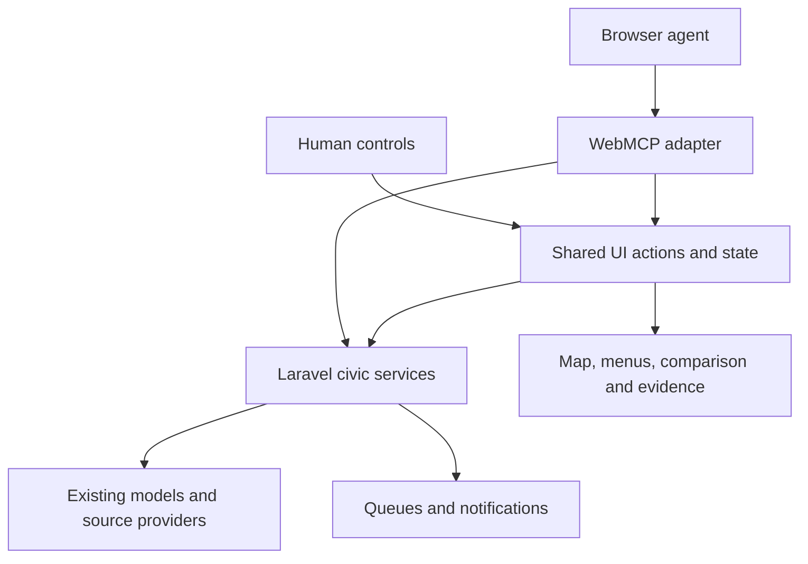

# WebMCP data and interface implementation plan

Status: proposed implementation backlog. Prepared September 22, 2026. This document adds a plan; the capabilities described as proposed are not implemented by this change.

## Product outcome

A person can ask their browser assistant to research a race and arrange the u9itus interface around that research. The map, selected menus, candidate cards, evidence panels, and visual preferences remain usable by hand throughout.

First-release demonstration: “Show California district 12, compare two candidates returned for that district, show funding evidence, use high contrast, and put the details panel on the left.” The interface visibly applies each supported action and provides undo/reset for presentation changes.

## Existing foundation and gaps

| Area | Existing implementation | Planned extension |
| --- | --- | --- |
| Tool registration | `resources/js/webmcp/index.js`: nine civic tools, current-page context, registration compatibility adapter | Separate transport, data tools, UI tools, schemas, and registration lifecycle |
| Civic reads and submissions | `app/Http/Controllers/Api/WebMcpController.php`, `/api/v1/mcp/*` in `routes/api.php` | Reusable services and consistent evidence, coverage, and error contracts |
| Geographic resolution | `DistrictLookupService`, `ZipDistrictLookupService`, `MapDistrictLookupService` | Tool adapter returning stable jurisdiction handles and ambiguity information |
| Map state | `resources/js/map/state/map-state.js`: selected geography, color mode, depth, layers, favorites | Serializable state snapshot and validated shared actions |
| Navigation | `navigation/deep-link.js` exposes `window.__mapGoTo`; `mode-transitions.js` implements transitions | Awaitable action facade with completion, cancellation, and URL consistency |
| Menus | `ui/controls-menu.js`, `ui/mobile-menu.js` | Shared explicit open/select actions; keyboard and agent actions use the same path |
| Comparisons | `ui/candidate-comparison.js`, `ui/saved-comparisons.js`, `MapCandidateComparisonController` | Explicit candidate selection, ordering, section focus, and evidence display |
| Appearance | `resources/css/map.css` includes hard-coded colors; map has region/party/poverty color modes | Theme tokens and supported responsive layout presets |
| Verification | Map Playwright tests, comparison JS tests, WebMCP feature tests | Action parity, lifecycle, race-condition, and native-browser integration checks |

Portal-builder work is present in the working tree. Treat portal integration as a later adapter after that work stabilizes; the map is the first implementation surface.

## Architecture

Use one action implementation for manual controls and WebMCP. Avoid simulated clicks, arbitrary selectors, injected HTML, and arbitrary CSS as tool inputs. UI actions consume validated entity handles and enums. Browser compatibility stays inside the adapter; civic services do not depend on WebMCP.

Proposed module boundaries:

- `resources/js/webmcp/`: adapter, catalog, schemas, results, data-tools, ui-tools.
- `resources/js/map/actions/`: navigation, menus, comparison, appearance, and action history.
- `resources/js/map/state/ui-state.js`: serializable UI state and revision tracking, integrating existing map state rather than maintaining competing selections.
- `app/Services/Civic/`: extract reusable queries and response assembly incrementally from controllers. Keep existing routes and payload fields compatible.

## Data handles and contracts

“Data handles” means stable identifiers the agent can retrieve and pass to another tool. Display names are labels, not identifiers.

| Handle | Proposed contract | Resolution rules |
| --- | --- | --- |
| Candidate | Existing `candidate_uuid` | Reuse published-profile UUIDs; adapt internal numeric IDs at service boundaries |
| Jurisdiction | `{ state, level, district, boundary_version }` | Include district system/version; ZIP lookup can return multiple possible districts |
| Contest | `contest_id` plus election date and jurisdiction | Establish canonical mapping to existing records before exposing; do not equate all candidates in a state with one race |
| Measure | Stable existing key or new public UUID after model audit | Include jurisdiction and election cycle; measure numbers alone are insufficient |
| Evidence | `evidence_id` scoped to a record/source revision | Resolve only evidence associated with returned civic data; include source URL and dates |
| Video segment | `{ media_id, start_seconds, end_seconds }` | Later phase; requires transcript provenance and supported player adapter |
| UI target | Enumerated `menu_id`, `panel_id`, `section_id` | Returned by current capabilities; no DOM selectors |
| UI action | `action_id`, `state_revision` | Supports completion, conditional undo, and stale-state detection |

For new data tools, return an application payload containing `schema_version`, `status`, `data`, `coverage`, `sources`, and pagination where applicable. Wrap this using the browser adapter's supported result format; these fields are u9itus conventions, not claims about required WebMCP fields.

Coverage includes geographic scope, election/reporting period, last checked time when known, and `complete | partial | unknown`. Source records distinguish publication time, retrieval time, and reporting period. Do not invent freshness dates or claim no races exist from an empty database result. Finance data distinguishes contributions from independent spending and identifies the reporting period. Address input is transient by default and omitted from action logs and shared URLs.

Application errors use stable codes such as `INVALID_ARGUMENT`, `NOT_FOUND`, `AMBIGUOUS_LOCATION`, `AUTH_REQUIRED`, `UNAVAILABLE_ON_PAGE`, `STALE_STATE`, `RATE_LIMITED`, and `SOURCE_UNAVAILABLE`. Include a useful message and retry guidance only when known. Catch network, parse, and timeout failures consistently. Existing tools gain metadata additively before any versioned breaking changes.

## Proposed tool catalog

All names below have the `u9itus_` prefix. Keep the existing nine names stable.

| Tool | Inputs | Observable result | Phase |
| --- | --- | --- | --- |
| `get_ui_state` | None | Page, supported actions/options, selected geography, panels, theme, layout, revision | 1 |
| `resolve_location` | Address OR ZIP OR explicit jurisdiction | Jurisdiction candidates, precision, ambiguity and source coverage | 2 |
| `get_races` | Jurisdiction, election date/cycle | Known contests, candidate UUIDs, coverage; not automatically a complete ballot | 2 |
| `get_evidence` | Candidate/measure handle, section, optional evidence ID | Cited records for rendering and research | 2 |
| `select_geography` | Jurisdiction handle | Map transition, selected boundary, loaded panel, final state | 1 |
| `set_map_options` | Color mode, explicit layer states, flat/3D mode | Matching map and legend updates | 1 |
| `set_menu_state` | Menu ID, open boolean, optional supported selection | Selected control and matching content; accessible state updated | 1 |
| `set_candidate_filters` | Supported office/running/party filters | Filter controls, visible results, count and empty/loading state | 2 |
| `open_candidate_comparison` | 2–4 UUIDs, supported section | Visible cards in requested order using the existing data services | 2 |
| `show_evidence` | Evidence ID | Source drawer with passage/data, dates and source link | 2 |
| `set_appearance` | Theme, accent preset, text scale, motion preference | CSS and applicable canvas appearance update | 3 |
| `set_layout` | Layout preset, details side, ordered panel IDs | Responsive arrangement; returns actual applied layout | 3 |
| `undo_ui_action` | Action ID, expected revision | Restore eligible prior presentation state | 1 |
| `reset_ui_preferences` | Scope: appearance/layout/all presentation | Restore presentation defaults without clearing civic account data | 3 |
| `save_civic_watch` | Entity, supported change types/channel | Authenticated subscription and management link | 4 |
| `prepare_question` | Candidate UUID, question | Editable preview; separate reviewed submission | 4 |
| `seek_candidate_video` | Media handle, timestamp | Open/seek supported player; explain blocked playback | 4 |

Publish only tools supported by the mounted page. `get_ui_state` lists available menu and panel IDs, accepted options, and disabled reasons. Authentication is enforced on the server even when account tools are hidden from guests. On navigation, remove page-specific registrations and register after mount; unsupported browsers retain the manual experience.

## Interface behavior

### Navigation, menus and map

Extract complete actions from existing event handlers. Calling a raw map-state setter is insufficient: the action must also update geometry/materials, camera, panels, selected buttons, legend, URL, and accessible state as applicable. Prefer `open: true` or `enabled: false` over toggles so retries do not reverse the intended action.

An action resolves only when its visible outcome is ready, or returns a pending operation explicitly. Cancel stale fetches/transitions when a newer selection supersedes them. User interaction supersedes an older pending agent action. Use state revisions to avoid an old undo overwriting newer user changes. Navigation uses consistent history entries, and handles back/forward navigation through the same state path.

### Colors

Introduce tokens for background, surface, text, muted text, accent, border, focus, and selection. Start with default dark, light, and high-contrast themes plus a small accent palette. Propagate relevant tokens to Three.js materials and redraw the scene. Keep semantic map data colors and legends synchronized; changing the interface accent must not change the meaning of party or poverty colors. Verify readable text and distinguish selected states without relying on color alone.

### Moving items and menu selections

Support explicit presets: map-focused, split-view, and comparison-focused. Permit left/right detail panels and card/panel ordering within defined containers. Use layout rules that preserve meaningful reading and keyboard order. On narrow screens, apply a stacked layout and report that resolved layout. Resizing must update the renderer and camera aspect and keep overlays aligned. Custom pixel coordinates and free-form styling are out of first-release scope.

### Feedback and persistence

Show a small accessible action message such as “Opened funding comparison” with Undo when applicable. Preserve focus unless the action intentionally opens a dialog; manage dialog focus and restoration. Respect reduced motion. Loading and error states must match what the tool reports.

Use URL state for shareable civic selections, session state for temporary panel/menu changes, and versioned local storage for explicitly saved appearance/layout preferences. Default agent appearance changes to the current session; provide an explicit save option. Keep addresses, question drafts, and account information out of share URLs and general action telemetry.

## Delivery sequence and acceptance gates

| Phase | Work package | Exit condition |
| --- | --- | --- |
| 0 — Contract baseline | Inventory mounted pages and menu IDs; reconcile stale `doc/WEBMCP.md` details with code; define schema/error fixtures and feature flags | Catalog documents supported pages, data handles, result states and defaults |
| 1 — Shared controls | Extract navigation/menu/map actions; add state snapshot, completion and conditional undo; register page-scoped UI tools | Agent and manual controls produce identical selected state and visible map; no stale selection overwrite |
| 2 — Civic workspace | Add location/race/evidence service adapters; connect filters, comparisons and evidence drawer | A resolved jurisdiction leads to real candidates and cited visible comparisons; incomplete coverage is explicit |
| 3 — Visual customization | Theme tokens, canvas palette integration, layouts, panel ordering, reset/save preferences | Desktop and mobile support requested colors/layouts, preserve keyboard access and recover through undo/reset |
| 4 — Participation | Integrate authenticated watches and question preparation; audit media/transcript availability before video tools | Account authorization and duplicate protection hold; reviewed writes and background notifications work after page close |
| 5 — Expansion | Evaluate full ballot coverage, vote/issue evidence, video search, portal adapters and optional remote MCP | Each capability ships only with established source coverage and its own acceptance journey |

Recommended first public release: phases 0–3, limited to the map and its research panels. This directly delivers both data access and the requested menu, color, and movement capabilities. Estimate effort after phase 0 resolves the race/evidence model mapping and navigation completion contract.

## Verification and rollout

- Extend existing Laravel feature coverage for handle resolution, partial/empty data, finance provenance, validation and JSON errors. Later writes require authorization and duplicate-request tests.
- Add meaningful JS tests for action completion, explicit set semantics, user/agent conflicts, and conditional undo.
- Extend `tests/e2e/map-ux.spec.ts` or add a focused WebMCP UX spec: geography → comparison → evidence → appearance → layout → undo; assert visible state and returned state agree.
- Exercise desktop/mobile, keyboard focus, back/forward, reduced motion, slow requests and failed sources. Verify map resize and legend colors visually.
- Use a mock WebMCP surface for deterministic registration/tool tests, then test a supporting real browser separately. Mock registration does not prove native compatibility or natural-language tool selection.
- Run relevant PHP tests, JS tests, focused Playwright tests, and `npm run build` for implementation changes. No runtime tests are needed for this planning document alone.
- Roll out behind separate data/UI/appearance/account capability flags. Keep compatibility checks in the adapter and allow individual capability rollback. Track completion/failure, latency, stale cancellations and undo frequency without recording sensitive arguments.

## Future browser assumptions

WebMCP remains an evolving proposal, not an adopted W3C Standard. Current Chrome documentation describes an origin trial and site-visit-based tool discovery. Keep the adapter replaceable and verify the API against the browser version used for release. Tool registration does not give control of other sites, browser settings, or a background scheduler. Persistent watches belong to Laravel queues and scheduled jobs.

References, reviewed for this plan:

- [WebMCP draft, September 17, 2026](https://webmachinelearning.github.io/webmcp/)
- [Chrome WebMCP documentation](https://developer.chrome.com/docs/ai/webmcp)

## First implementation task

Build `get_ui_state`, `select_geography`, `set_menu_state`, and `set_map_options` around the existing map controls, including completion reporting and one-step conditional undo. This establishes the shared action architecture before introducing new datasets or broad CSS changes.
